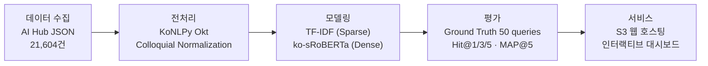
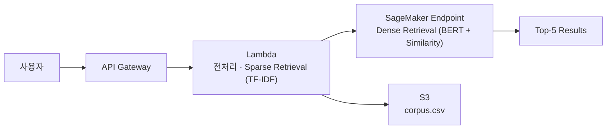

# 🐾 반려견 증상 매칭 AI

[](https://alices-project-storage.s3.ap-northeast-2.amazonaws.com/pet-health-ai/dashboard/index.html)
[]()
[]()
[]()
[]()

> 보호자가 "밥을 안 먹어요"라고 입력하면,  
> 21,604건 수의사 Q&A에서 의미적으로 가장 유사한 답변을 즉시 추천합니다.

---

## 프로젝트 배경

반려견 보호자는 증상이 나타나도 어떤 진료과에 가야 할지,
얼마나 급한지 판단하기 어렵습니다.

기존 키워드 검색(TF-IDF)은 "구토" ↔ "토해요",
"파행" ↔ "절뚝거려요"처럼 표현이 달라지면 같은 증상을 놓칩니다.

본 프로젝트는 Sentence-BERT(`ko-sroberta-multitask`)를 활용해
의미 기반 매칭을 구현하여, 구어체 질문도 정확히 처리할 수 있도록
설계하였습니다.

---

## 결과 요약

| 지표 | TF-IDF | Sentence-BERT | 향상 |
|------|--------|--------------|------|
| Hit@1 | 18.0% | **24.0%** | +6.0 %p |
| Hit@3 | 48.0% | **52.0%** | +4.0 %p |
| Hit@5 | 62.0% | 62.0% | ±0 %p |
| MAP@5 | 9.74% | **12.87%** | +3.13 %p |

> 검증셋 50 queries (자견 17 · 성견 17 · 노령견 16), 소프트 매치 기준

**주요 발견**
- BERT 우위: Hit@1·Hit@3·MAP@5에서 BERT가 TF-IDF 상회
- Hit@5 수렴: k가 커지면 두 방법이 동률로 수렴 — BERT 실질 우위는 Top-1~3 구간
- 생애주기별 반전: 자견(BERT +17.6%p) vs 성견(TF-IDF +5.9%p)
- 공통 실패 패턴: 의료 절차 질문(50%) · 이물질 급성 상황(30%) · 희귀 질병(20%)

---

## 빠른 시작

```bash
git clone https://github.com/alicesworld88-debug/pet-health-ai.git
cd pet-health-ai
pip install -r requirements.txt
python run_dashboard.py
# → 브라우저가 자동으로 열리며 인터랙티브 대시보드 확인
```

> 데이터 경로: `utils/config.py`의 `_LOCAL_ROOT`를 AI Hub 데이터 압축 해제 경로로 수정

---

## 시스템 아키텍처

### 파이프라인



### 인프라

**현재 — S3 정적 호스팅**


평가 결과를 HTML에 사전 임베딩 후 S3에 정적 배포 — Offline Precomputation (No real-time inference)

**목표 — 실시간 API 서비스**



쿼리 입력 시 실시간 BERT 추론 · CloudWatch 모니터링 연계

---

## 분석 파이프라인

| # | 노트북 | 내용 | 출력 |
|---|--------|------|------|
| 01 | `01_data_collection.ipynb` | AI Hub JSON 병렬 로드 | `corpus_raw.csv` |
| 02 | `02_data_validation.ipynb` | 결측치·중복·이상치 처리 | `corpus_validated.csv` |
| 03 | `03_preprocessing.ipynb` | 형태소 분석·구어체 정규화 | `corpus_preprocessed.csv` |
| 04 | `04_eda.ipynb` | 생애주기별 질병 분포·시각화 | `eda_figures/` |
| 05 | `05_ground_truth.ipynb` | 평가용 쿼리 50개 구축 | `ground_truth.csv` |
| 06 | `06_matching.ipynb` | TF-IDF / SBERT 매칭 실행 | `matching_results.csv` |
| 07 | `07_evaluation.ipynb` | Hit@1/3/5, MAP@5 비교 | `evaluation_summary.csv` |

---

## 폴더 구조

```
pet-health-ai/
├── notebooks/          # 분석 노트북 01~07
├── app/
│   └── dashboard.html  # 인터랙티브 대시보드
├── utils/
│   ├── config.py       # 경로·환경 설정
│   ├── matcher.py      # TF-IDF / BERT 매칭
│   ├── app_builder.py  # APP_DATA 빌더
│   ├── chart_builder.py
│   └── theme.py        # 디자인 시스템
├── data/
│   ├── processed/      # 전처리 CSV, 임베딩 .npy
│   └── splits/         # ground_truth.csv
├── docs/
│   ├── concept_model.md      # 도메인 개념 모델
│   ├── evaluation_tables.md  # 보고서용 평가 수치
│   └── aws_migration.md
├── run_dashboard.py    # 대시보드 로컬 실행
├── deploy_aws.py       # S3 배포 스크립트
└── requirements.txt
```

---

## 핵심 기술

| 구분 | 내용 |
|------|------|
| 형태소 분석 | KoNLPy Okt — 명사/동사/형용사 추출, 불용어 제거 |
| Colloquial Normalization | 구어체 → 표준 의학 용어 변환 사전 (`COLLOQUIAL_MAP`) |
| Sparse Retrieval | `TfidfVectorizer` + 코사인 유사도 |
| Dense Retrieval | `jhgan/ko-sroberta-multitask` — 한국어 의미 임베딩 |
| 평가 | Hit@1/3/5, MAP@5, 소프트 매치 기준 |
| 시각화 | Plotly + React (Babel standalone) |

---


## 작성자

성균관대학교 대학원 빅데이터학과 정은영 (2025720370)  
데이터마이닝(2026)
