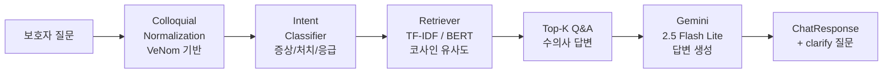
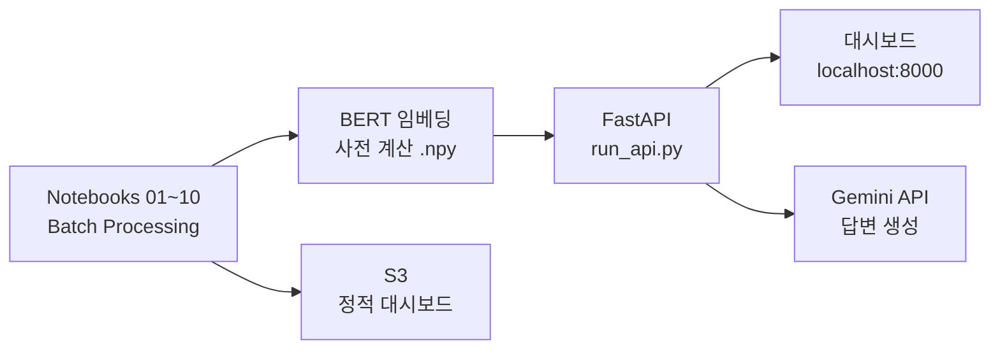

# 🐾 반려견 증상 매칭 AI

[](https://alices-project-storage.s3.ap-northeast-2.amazonaws.com/pet-health-ai/dashboard/index.html)
[]()
[]()
[]()
[]()
[]()

> 보호자가 "밥을 안 먹어요"라고 입력하면,  
> 21,604건 수의사 Q&A에서 가장 유사한 답변을 찾고,  
> Gemini가 맥락에 맞는 답변을 생성합니다.

---

## 프로젝트 배경

반려견 보호자는 증상이 나타나도 어떤 진료과에 가야 할지,
얼마나 급한지 판단하기 어렵습니다.

기존 키워드 검색(TF-IDF)은 "구토" ↔ "토해요",
"파행" ↔ "절뚝거려요"처럼 표현이 달라지면 같은 증상을 놓칩니다.

본 프로젝트는 Sentence-BERT(`ko-sroberta-multitask`)로 의미 기반 검색을 구현하고,
Gemini 2.5 Flash Lite로 RAG 답변을 생성하는 AI 수의사 채팅 시스템입니다.

---

## 결과 요약

### 수동 평가 (Ground Truth 50건)

| 지표 | TF-IDF | Sentence-BERT | 향상 |
|------|--------|--------------|------|
| Hit@1 | 18.0% | **24.0%** | +6.0 %p |
| Hit@3 | 48.0% | **52.0%** | +4.0 %p |
| Hit@5 | 62.0% | 62.0% | ±0 %p |
| MAP@5 | 9.74% | **12.87%** | +3.13 %p |

### 전체 데이터 평가 (Validation 2,399건, 소프트 매치)

| 지표 | TF-IDF | Sentence-BERT |
|------|--------|--------------|
| Hit@1 | 23.8% | **24.7%** |
| Hit@3 | **52.3%** | 52.1% |
| Hit@5 | **67.8%** | 67.4% |
| MAP@5 | 37.9% | **38.3%** |

> McNemar test p = 0.46 — 전체 데이터 기준 두 모델의 차이는 통계적으로 유의미하지 않음.  
> BERT 우위는 의미적으로 어려운 쿼리(구어체, 희귀 증상)에서 집중적으로 발생.

**주요 발견**
- BERT 우위: 수동 GT 기준 Hit@1·Hit@3·MAP@5에서 BERT 상회
- 생애주기별 반전: 자견(BERT +17.6%p) vs 성견(TF-IDF +5.9%p) — n=17 소표본 효과
- 전체 데이터(n=808)에서는 성견도 BERT 소폭 우위 → 소표본 편향 확인
- BERT 추론 비용: 쿼리 레이턴시 50ms, 메모리 63MB (TF-IDF 대비 3.7배, 5.7배)

---

## 빠른 시작

### 대시보드 (정적 분석)
```bash
git clone https://github.com/alicesworld88-debug/pet-health-ai.git
cd pet-health-ai
pip install -r requirements.txt
python run_dashboard.py
# → 브라우저에서 인터랙티브 대시보드 자동 열림
```

### AI 채팅 (RAG 파이프라인)
```bash
conda activate pet-health   # Python 3.11 환경
# .env 파일에 VERTEX_API_KEY 설정 필요 (Vertex AI Express mode)
python run_api.py
# → http://localhost:8000 에서 채팅 탭 사용 가능
```

> 데이터 경로: `utils/config.py`의 `_LOCAL_ROOT`를 AI Hub 데이터 경로로 수정

> **📦 데이터 배포 정책**
> 원천 데이터(AI Hub)의 **재배포 라이선스 제한**과 GitHub **파일 용량 제한(100MB)**에 따라, 데이터는 저장소와 객체 스토리지(S3)에 **분산 배포**합니다.
> - **GitHub 저장소**: 네이버 지식iN **수집 데이터**, 학습된 **모델 산출물**(intent 분류기), **평가 지표 결과**, **EDA 시각화 산출물**, 평가용 **Ground Truth**
> - **AWS S3 (객체 스토리지)**: AI Hub **원천 데이터** 및 전처리 코퍼스, 사전 계산된 **BERT 임베딩** 등 대용량 산출물
> 전체 데이터 명세(출처·라이선스·규모·스키마·용도)는 **[`data/README.md`](data/README.md)** 에 정리되어 있습니다.

---

## 시스템 아키텍처

### RAG 파이프라인



### 멀티 에이전트 구조

```
query → IntentClassifier
           ├── SymptomAgent   (증상, top_k=5, 증상 전용 프롬프트)
           ├── TreatmentAgent (처치, top_k=5, 처치 전용 프롬프트)
           └── EmergencyAgent (응급, top_k=3, ⚠️ 병원 방문 강제 안내)
```

### 인프라

**현재 — Batch Processing + FastAPI**



**목표 — 실시간 API 서비스**


---

## COLLOQUIAL_MAP — VeNom 기반 온톨로지 동의어 레이어

보호자 구어체 → 수의학 표준 용어 → VeNom 국제 표준 앵커로 연결되는 3단계 매핑.  
VeNom 데모(venomcoding.org)에서 매칭률 분산이 큰 증상은 챗봇이 자동으로 되묻습니다.

| 한국어 구어체 (AI Hub 추출) | 표준 용어 | VeNom 앵커 | clarify |
|--------------------------|---------|-----------|--------|
| 긁어요 / 가려워 / 발을 핥아요 | 소양감 | 가려움증 (Pruritus) 100% | — |
| 토해요 / 구역질 / 게워 | 구토 | 구토-기타 83% / 구토-토혈 18% | ✅ "혈액이 섞여 있었나요?" |
| 기침해요 / 콜록 | 기침 | 기침 69% / 호흡곤란동반 13% | ✅ "호흡 곤란도 있나요?" |
| 절뚝거려요 / 다리를 절 | 파행 | 보행이상-절뚝거림 100% | — |
| 안 먹어요 / 밥 안 먹어요 | 식욕부진 | 식욕부진 100% | — |
| 눈곱 / 눈물 | 안구 분비물 | 눈 분비물 100% | — |
| 털이 빠져 | 탈모 | (탈모증) | — |
| 쌕쌕 / 숨이 차 | 호흡음 이상 | 호흡곤란 계열 | — |

> 전체 34개 항목 및 구축 방법론: [`docs/colloquial_map_rationale.md`](docs/colloquial_map_rationale.md)

---

## 분석 파이프라인

| # | 노트북 | 내용 | 출력 |
|---|--------|------|------|
| 01 | `01_data_collection.ipynb` | AI Hub JSON 병렬 로드 | `corpus_raw.csv` |
| 02 | `02_data_validation.ipynb` | 결측치·중복·이상치 처리 | `corpus_validated.csv` |
| 03 | `03_preprocessing.ipynb` | 형태소 분석·구어체 정규화 (COLLOQUIAL_MAP 34개) | `corpus_preprocessed.csv` |
| 04 | `04_eda.ipynb` | 생애주기별 질병 분포·시각화 | `eda_figures/` |
| 05 | `05_ground_truth.ipynb` | 평가용 쿼리 50개 구축 | `ground_truth.csv` |
| 06 | `06_matching.ipynb` | TF-IDF / SBERT 매칭 실행 | `matching_results.csv` |
| 07 | `07_evaluation.ipynb` | Hit@1/3/5, MAP@5 비교 | `evaluation_summary.csv` |
| 08 | `08_full_evaluation.ipynb` | Validation 2,399건 전체 평가 + McNemar test | `full_matching_results.csv` |
| 09 | `09_adult_dog_analysis.ipynb` | 성견 TF-IDF 우위 가설 검증 (소표본 편향 발견) | — |
| 10 | `10_cost_analysis.ipynb` | BERT vs TF-IDF 추론 비용 측정 | — |

---

## 폴더 구조

```
pet-health-ai/
├── notebooks/              # 분석 노트북 01~10
├── app/
│   ├── dashboard.html      # 인터랙티브 대시보드 (React + Plotly)
│   └── api.py              # FastAPI 백엔드 (채팅 API)
├── utils/
│   ├── config.py           # 경로·환경 설정
│   ├── matcher.py          # TF-IDF / BERT 매칭
│   ├── generator.py        # Gemini 답변 생성 (Vertex AI)
│   └── app_builder.py      # 대시보드 데이터 빌더
├── chat.py                 # RAG 파이프라인 (멀티 에이전트)
├── data/
│   ├── processed/          # 전처리 CSV, 임베딩 .npy
│   └── splits/             # ground_truth.csv
├── docs/
│   ├── colloquial_map_rationale.md  # COLLOQUIAL_MAP 구축 근거 + VeNom 검증
│   ├── concept_model.md             # 도메인 개념 모델
│   └── evaluation_tables.md         # 보고서용 평가 수치
├── run_dashboard.py        # 대시보드 로컬 실행
├── run_api.py              # 채팅 서버 실행 (FastAPI)
├── run_full_eval.py        # 전체 데이터 평가 실행
└── requirements.txt
```

---

## 핵심 기술

| 구분 | 내용 |
|------|------|
| 형태소 분석 | KoNLPy Okt — 명사/동사/형용사 추출, 불용어 제거 |
| Colloquial Normalization | 구어체 → 수의학 표준 용어 (COLLOQUIAL_MAP 34개, VeNom 검증) |
| Sparse Retrieval | `TfidfVectorizer` + 코사인 유사도 (13ms/query) |
| Dense Retrieval | `jhgan/ko-sroberta-multitask` — 한국어 의미 임베딩 (50ms/query) |
| RAG 생성 | Gemini 2.5 Flash Lite (Vertex AI Express mode) |
| 멀티 에이전트 | 증상 / 처치 / 응급 전담 에이전트, intent별 프롬프트 분리 |
| 되묻기 | VeNom 분산 증상 5종 자동 감지 → clarify 질문 생성 |
| 평가 | Hit@1/3/5, MAP@5, McNemar test, Paired Bootstrap |
| 시각화 | Plotly + React (Babel standalone) |

---

## 작성자

성균관대학교 대학원 빅데이터학과 정은영 (2025720370)  
데이터마이닝(2026)
